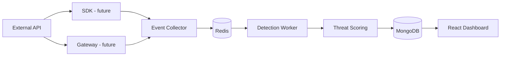

# System Architecture

Event ingestion will flow through SDK and Gateway (both future) into the Event Collector, then through an asynchronous pipeline (Redis/BullMQ → Detection → Scoring → MongoDB) to the React Dashboard.

